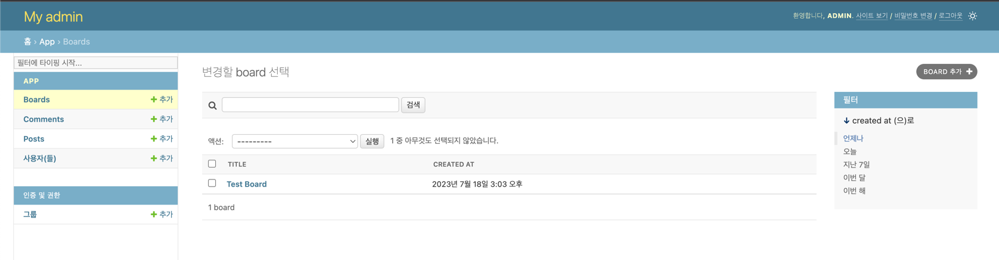
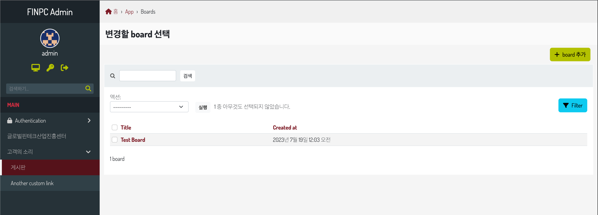
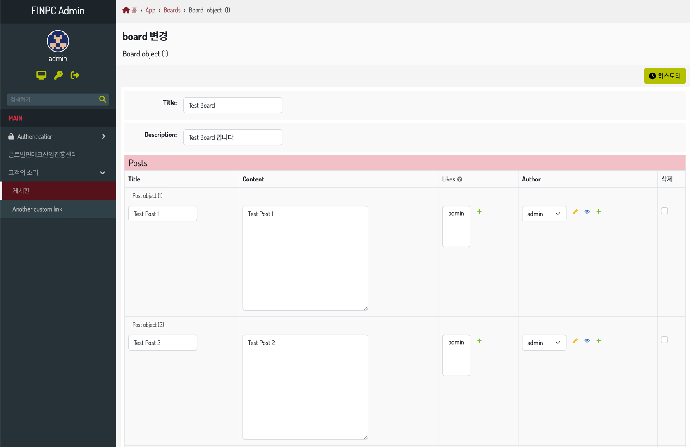

# 02. Admin 구성하기

## 02.01. Django Project 언어 변경
```python
# settings.py
LANGUAGE_CODE = 'ko-kr'
TIME_ZONE = 'Asia/Seoul'
```


## 02.02. 모델어드민 설정
```python
from django.contrib import admin
from app.models import User, Board, Post, Comment


admin.site.site_header = "My admin"


class BoardModelAdmin(admin.ModelAdmin):
    list_display = ("title_", "created_at_")
    list_filter = ("created_at",)
    search_fields = ("title",)


# Register your models here.
admin.site.register(User)
admin.site.register(Board, BoardModelAdmin)
admin.site.register(Post)
admin.site.register(Comment)
```



## 02.03. 테마 바꾸기

BATON 다운로드 : https://github.com/otto-torino/django-baton

```bash
pip install django-baton
```

```python
# settings.py
INSTALLED_APPS = [
    "baton",  # django.contrib.admin 보다 먼저
    "django.contrib.admin",
    ...
    "baton.autodiscover",   # 가장 마지막
]


BATON = {
    "SITE_HEADER": "FINPC Admin",
    "SITE_TITLE": "Hello FINPC",
    "INDEX_TITLE": "Site administration",
    "COPYRIGHT": "copyright © 2023 TAEHUN LEE",  # noqa
    "CONFIRM_UNSAVED_CHANGES": True,
    "SHOW_MULTIPART_UPLOADING": True,
    "ENABLE_IMAGES_PREVIEW": True,
    "CHANGELIST_FILTERS_IN_MODAL": True,
    "CHANGELIST_FILTERS_ALWAYS_OPEN": False,
    "CHANGELIST_FILTERS_FORM": True,
    "MENU_ALWAYS_COLLAPSED": False,
    "MENU_TITLE": "메뉴",
    "MESSAGES_TOASTS": True,
    "GRAVATAR_DEFAULT_IMG": "retro",
    "GRAVATAR_ENABLED": True,
    "LOGIN_SPLASH": "/static/core/img/login-splash.png",
    "SEARCH_FIELD": {
        "label": "검색하기...",
        "url": "/search/",
    },
    "MENU": (
        {"type": "title", "label": "main", "apps": ("auth",)},
        {
            "type": "app",
            "name": "auth",
            "label": "Authentication",
            "icon": "fa fa-lock",
            "models": (
                {"name": "user", "label": "Users"},
                {"name": "group", "label": "Groups"},
            ),
        },
        {"type": "title", "label": "Contents", "apps": ("flatpages",)},
        {"type": "model", "label": "Pages", "name": "flatpage", "app": "flatpages"},
        {
            "type": "free",
            "label": "글로벌핀테크산업진흥센터",
            "url": "http://finpc.org/",
            "perms": ("flatpages.add_flatpage", "auth.change_user"),
        },
        {
            "type": "free",
            "label": "고객의 소리",
            "default_open": True,
            "children": [
                {"type": "model", "label": "게시판", "name": "board", "app": "app"},
                {"type": "free", "label": "Another custom link", "url": "http://www.google.it"},
            ],
        },
    ),
}
```

```python
# urls.py
from django.contrib import admin
from django.urls import path, include

urlpatterns = [
    path("admin/", admin.site.urls),
    path("baton/", include("baton.urls")),
]
```



## 02.04. TabularInline 사용하기


```python
from django.contrib import admin
from app.models import User, Board, Post, Comment


admin.site.site_header = "My admin"


class PostInline(admin.TabularInline):
    model = Post
    extra = 0


class BoardModelAdmin(admin.ModelAdmin):
    list_display = ("title_", "created_at_")
    list_filter = ("created_at",)
    search_fields = ("title",)
    inlines = [PostInline]

    def title_(self, obj):
        return obj.title

    def created_at_(self, obj):
        return obj.created_at

    title_.short_description = "제목"
    created_at_.short_description = "생성 시간"


# Register your models here.
admin.site.register(User)
admin.site.register(Board, BoardModelAdmin)
admin.site.register(Post)
admin.site.register(Comment)
```

