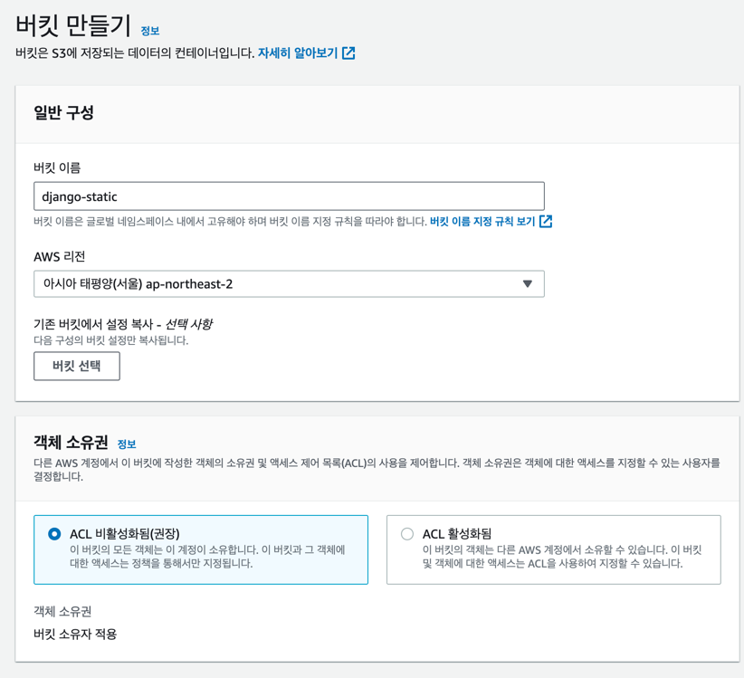
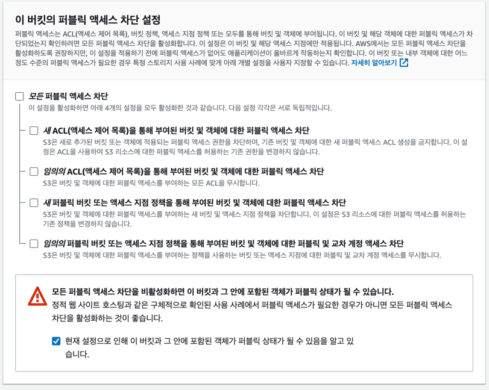

# 04. 정적파일 서빙

## 04.01 S3 버킷 생성




## 04.02 권한 주입
S3 권한 


Json 버킷 정책 편집
```json
{
    "Version": "2012-10-17",
    "Statement": [
        {
            "Sid": "AddPerm",
            "Effect": "Allow",
            "Principal": "*",
            "Action": "s3:GetObject",
            "Resource": "arn:aws:s3:::django-static/*"
        }
    ]
}
```

## 04.03 AWS 보안자격증명 발급
Slide 
"03. AWS & Remote DB - 03. AWS S3"

## 04.04 AWS CLI 설치
https://docs.aws.amazon.com/ko_kr/cli/latest/userguide/getting-started-install.html

## 04.05 AWS CLI 설정
```bash
aws configure
```
을 실행 후 AccessKey와 SecretAccessKey, Region(ap-northeast-2)을 입력한다.

## 04.06 Django S3 Storage 설치
```bash
pip install boto3
pip install django-storages
```

## 04.07 settings.py 설정
```python
STATIC_URL = "static/"  # 삭제
```
```python
# settings.py
INSTALLED_APPS = [
    ...
    'storages',
]


# AWS S3
AWS_STORAGE_BUCKET_NAME = "django-static"
AWS_S3_REGION_NAME = "ap-northeast-2"
AWS_S3_CUSTOM_DOMAIN = f"{AWS_STORAGE_BUCKET_NAME}.s3.amazonaws.com"
AWS_S3_SECURE_URLS = True
AWS_DEFAULT_ACL = "public-read"
AWS_LOCATION = "admin-static"
STATICFILES_STORAGE = "storages.backends.s3boto3.S3Boto3Storage"
STATIC_URL = f"https://{AWS_S3_CUSTOM_DOMAIN}/admin-static/"


# Default primary key field type
# https://docs.djangoproject.com/en/3.2/ref/settings/#default-auto-field

DEFAULT_AUTO_FIELD = "django.db.models.BigAutoField"
STATICFILES_DIRS = [BASE_DIR / "static"]
STATIC_ROOT = BASE_DIR / "staticfiles"
```

## 04.08 collectstatic
```bash
python manage.py collectstatic
```

## 04.09 S3 버킷 정책 수정
```json
{
    "Version": "2012-10-17",
    "Statement": [
        {
            "Sid": "AddPerm",
            "Effect": "Allow",
            "Principal": "*",
            "Action": "s3:GetObject",
            "Resource": [
                "arn:aws:s3:::django-static/*",
                "arn:aws:s3:::django-static/admin-static/*"
            ]
        }
    ]
}
```
